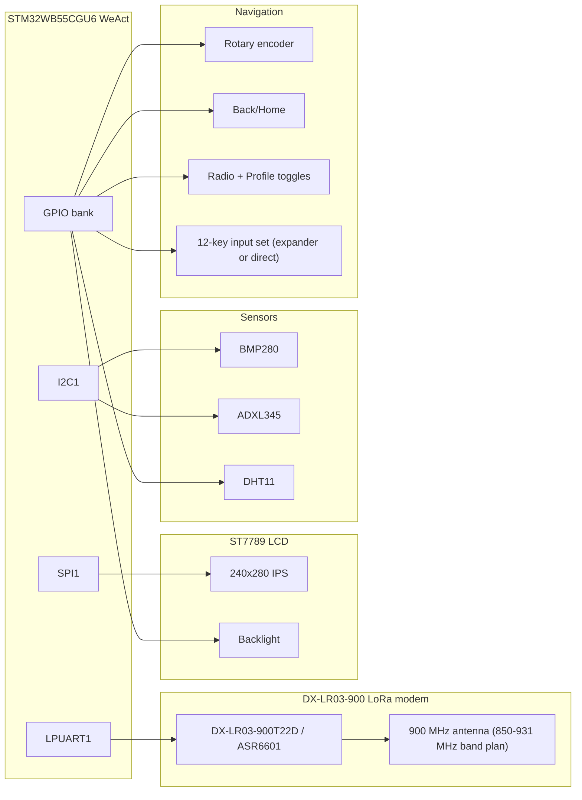

# Wiring Diagrams

Use these references for the first practical hardware pass. All diagrams are text-based
and do not require hardware interaction.

## System Architecture



## Wiring Focus for this repository

1. Start with bus integrity before signal-level features.
2. Keep the display on SPI1 and move radio to the dedicated UART path.
3. Keep all module grounds tied to a single low-impedance point near the MCU.
4. Add small-value local decoupling at each module: 10 µF + 0.1 µF per power pin.

## Power and Signal Conventions

Use this physical convention during first assembly:

- Radio module VCC: stable 5 V rail, then 3.3 V logic on module pins.
- All UART pins: short wires and no long stubs for first bring-up.
- Shared buses on removable jumpers until first smoke stage passes.
- Pull-ups:
  - DHT11 data: 4.7 kΩ to 3.3 V.
  - I2C SDA/SCL: 4.7 kΩ to 3.3 V each if not present on modules.
- Keep USB connector and debug pads from high-frequency wiring.

## ASCII Pin Map Summary

```text
            +------------------------+
            |   STM32WB55CGU6 WeAct  |
            |                        |
    PB9 ----+-------------------> BMP280 SDA / ADXL345 SDA
    PB8 ----+-------------------> BMP280 SCL / ADXL345 SCL
    PB7 <--+--- GPS TX
    PB6 ----+--- GPS RX
    PB3 ----+---> SPI1 SCK
    PA7 ----+---> SPI1 MOSI
    PA6 <--+--- Encoder SW
    PB2 <--> DHT11 DATA
    PA4 ----+---> ST7789 CS
    PB4 ----+---> ST7789 DC
    PB5 ----+---> ST7789 RESET
    PA8 ----+---> ST7789 Backlight
    PA2 ----+---> DX-LR03 RXD
    PA3 <---+---- DX-LR03 TXD
    PB0 ----+---> DX-LR03 M0
    PB1 ----+---> DX-LR03 M1
    PA15 ---+<--- DX-LR03 AUX
    PA0 ----+<--- Encoder A
    PA1 ----+<--- Encoder B
    PC13 <--+--- Back button / onboard user key
    PA9 <--+--- Home button
    PA10 <--+--- Radio enable
    PA5 <--+--- Profile/power toggle
```

## Source Assets

- [assets/lora-endpoint-architecture.mmd](../assets/lora-endpoint-architecture.mmd)
- [assets/lora-endpoint-pin-map.mmd](../assets/lora-endpoint-pin-map.mmd)
- [assets/lora-endpoint-power-rails.dot](../assets/lora-endpoint-power-rails.dot)
